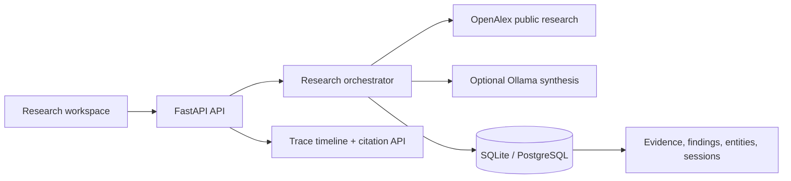

# Atlas Research Intelligence

Atlas is a local-first Enterprise AI Research Agent built for Modus Assignment 9. It turns a new question into a persistent, evidence-backed research session rather than a one-off chat response.

## Why this is demonstrably more than a chatbot

`question -> research plan -> public-source retrieval -> evidence extraction -> finding synthesis -> contradiction check -> persistent knowledge base -> cited executive brief`

Every stage is an API-visible run event. Sources, findings, evidence spans, confidence, and citations are stored in SQLite and survive restarts. The public-source connector uses OpenAlex (no API key); an optional local Ollama adapter can improve synthesis without changing the data model.

## Quick start

```bash
docker compose up --build
```

Open `http://localhost:3000`. The API documentation is at `http://localhost:8000/docs`.

For local development, install the backend environment with `cd backend && uv sync --all-groups`, then start it with `uv run uvicorn app.main:app --reload`. Run `npm install && npm run dev` in `frontend`.

## Architecture



## Demo flow

1. Enter a question the judges did not provide in advance.
2. Watch the persisted planner/retrieval/extraction/synthesis events.
3. Open the evidence panel to inspect source URLs, evidence spans and confidence.
4. Refresh the page and open the same session from the knowledge base.
5. Enter a related question and explain that the schema is ready for semantic retrieval over accumulated evidence.

## Engineering choices and migration path

- **Local-first:** SQLite is the default. Set `DATABASE_URL` to PostgreSQL for production.
- **Replaceable AI:** the deterministic, explainable fallback works without an LLM. `OLLAMA_BASE_URL` enables a local model adapter.
- **Retrieval:** OpenAlex is a free reproducible public research source. Add domain allowlists, web extraction, and Qdrant embeddings through adapters, not controller rewrites.
- **Evaluation:** seed the `backend/tests/fixtures/eval_questions.json` golden set and run the evaluator before demos.
- **Observability:** each agent step emits structured `run_events` with duration, status and metadata; `/v1/metrics/overview` powers operations dashboards.

## Repository guide

- `backend/app/domain` — persistence model and domain contracts
- `backend/app/services` — orchestration, providers, evidence and evaluation
- `backend/app/api` — versioned HTTP boundary
- `frontend/app` — Next.js research workspace
- `infra` — deployment and observability configuration
- `docs` — architecture and the hackathon demo narrative

## Safety and evidence policy

Atlas never represents a source title/abstract as a verified full-document claim. Findings identify their evidence basis; zero-source claims are blocked. Low-confidence or conflicting evidence is surfaced as uncertainty, not hidden.

## Product surface

- **Research workspace:** submit any new question, then inspect the full research run.
- **Evidence explorer:** findings retain excerpts, confidence, classifications and linked source records.
- **Persistent knowledge base:** `GET /v1/knowledge/search?q=...` searches retained evidence across runs.
- **Executive reporting:** `POST /v1/research/{session_id}/report` produces a portable, evidence-linked brief.
- **Operations:** `GET /v1/metrics/overview` exposes durable run, source and evidence counts.

## API surface

| Endpoint | Responsibility |
|---|---|
| `POST /v1/research` | Runs and persists a new evidence-backed research session |
| `GET /v1/research/{id}` | Retrieves an auditable research session |
| `GET /v1/knowledge/search?q=` | Searches retained findings across sessions |
| `POST /v1/research/{id}/report` | Persists an executive brief derived from retained evidence |
| `GET /v1/research/{id}/graph` | Returns evidence-source relationships for graph visualization |
| `POST /v1/organizations`, `POST /v1/projects` | Establishes organization/project ownership |
| `GET /v1/audit-logs` | Retrieves non-sensitive action history |
| `GET /v1/metrics/overview` | Returns durable platform health and quality metrics |

## Configuration

| Variable | Default | Purpose |
|---|---|---|
| `DATABASE_URL` | `sqlite:///./atlas.db` | SQLite locally; PostgreSQL-compatible SQLAlchemy URL in deployment |
| `CORS_ORIGINS` | `http://localhost:3000` | Comma-separated browser origins |
| `ATLAS_API_KEY` | unset | When set, all `/v1` calls require an `X-API-Key` header |
| `FIREWORKS_API_KEY`, `FIREWORKS_MODEL` | unset | Research planning and evidence-grounded synthesis |
| `FIREWORKS_EMBEDDING_MODEL` | unset | Embeddings used before Qdrant upserts/search |
| `UPSTASH_REDIS_REST_URL`, `UPSTASH_REDIS_REST_TOKEN` | unset | Retrieval-result semantic cache |
| `QDRANT_URL`, `QDRANT_API_KEY` | unset | Durable vector evidence store |
| `TAVILY_API_KEY` | unset | Current web search for Perplexity-style cited answers |
| `ENVIRONMENT` | `development` | Deployment environment marker |

For a production deployment, use PostgreSQL, terminate TLS at the ingress, set `ATLAS_API_KEY` through the secret manager, and replace the synchronous runner with a worker queue before high-volume ingestion.

Copy `.env.example` to `.env` for Docker Compose or `backend/.env.example` to `backend/.env` for local API development. Do not put any key in frontend environment files: only `NEXT_PUBLIC_API_URL` belongs there. When the three provider credentials are present, each run records Fireworks planning/synthesis, Upstash cache state, and Qdrant evidence indexing in the durable agent trace.

Set `TAVILY_API_KEY` to add current web evidence on every research turn. The `web_search` run event exposes whether Tavily completed, was skipped because no key was configured, or degraded; answers retain the resulting URLs and evidence excerpts.

## Verification

```bash
cd backend
uv run ruff check app tests scripts
uv run pytest
uv run python scripts/evaluate.py
```
