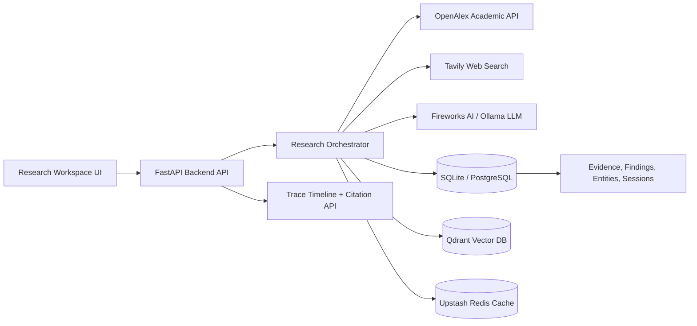

# Atlas Research Intelligence

Atlas is an autonomous, evidence-first **Enterprise AI Research Agent**. Built for deep research and synthesis, Atlas transforms a user question into a persistent, verifiable research session with structured evidence spans, entity relationships, citation tracking, and executive reports.

---

## 📌 Overview

Unlike standard conversational chatbots that generate stateless responses, Atlas executes a transparent, multi-stage agentic research pipeline. Every phase of research—from initial plan generation to external source retrieval, evidence extraction, synthesis, and contradiction verification—is logged as an auditable, API-visible run event.

### Why Atlas?

- 🧠 **Agentic Workflow:** Follows a structured research cycle: `Question -> Research Plan -> Web/Public Source Retrieval -> Evidence Extraction -> Finding Synthesis -> Contradiction Verification -> Persistent Knowledge Base -> Cited Executive Brief`.
- 🛡️ **Evidence Grounded:** Zero-source or unverified claims are blocked. Every finding is linked directly to exact source text spans, URLs, and confidence scores.
- 💾 **Local-First Persistence:** Defaults to SQLite for zero-setup local deployment, with optional PostgreSQL support for enterprise scale.
- 🔍 **Multi-Source Retrieval:** Leverages OpenAlex for academic/public literature research and Tavily API for real-time web search.
- 🚀 **Extensible Integrations:** Seamlessly connects with Fireworks AI (LLM synthesis & embeddings), Upstash Redis (semantic caching), and Qdrant (vector database).

---

## 🏗️ Architecture



---

## ✨ Features

### 🔍 Autonomous Multi-Stage Research Pipeline
- **Planning:** Generates structured research queries from broad questions.
- **Multi-Source Ingestion:** Fetches academic papers (OpenAlex) and live web results (Tavily).
- **Document Processing:** Upload and extract evidence from local PDF and TXT files.
- **Evidence Extraction:** Extracts verbatim evidence text spans with relevance scoring and confidence evaluation.
- **Contradiction Checking:** Identifies conflicting evidence across sources and surfaces uncertainty rather than hallucinating consistency.

### 📚 Knowledge Base & Vector Search
- **Persistent Storage:** All research sessions, findings, evidence spans, and entities survive system restarts.
- **Vector Indexing:** Integrates with Qdrant for semantic search over historical evidence across multiple research runs.
- **Semantic Caching:** Integrates with Upstash Redis to cache retrieval results and eliminate redundant API calls.

### 📄 Executive Briefing & Report Generation
- **Cited Reports:** Generates executive briefs backed by interactive, clickable citations.
- **Export & Share:** Export research summaries and structured reports.
- **Entity & Graph Analysis:** Maps relationships between extracted entities and research sources.

### 📊 Observability, Security & Metrics
- **Auditable Run Events:** Step-by-step execution metrics (duration, status, parameters) exposed per session.
- **API Key Security:** Built-in middleware supporting API key authentication (`X-API-Key`).
- **Platform Health Dashboard:** System health and quality metrics available at `/v1/metrics/overview`.
- **Audit Logging:** Structured audit trails for organization, project, and session actions.

---

## 🛠️ Tech Stack

### Backend
- **Framework:** [FastAPI](https://fastapi.tiangolo.com/) (Python 3.12+)
- **Server:** Uvicorn
- **ORM & DB:** [SQLAlchemy 2.0](https://www.sqlalchemy.org/) (SQLite / PostgreSQL)
- **Package Manager:** [`uv`](https://github.com/astral-sh/uv)
- **Document Ingestion:** `pypdf`, `python-multipart`
- **Validation:** Pydantic v2
- **Testing & Linting:** `pytest`, `ruff`

### Frontend
- **Framework:** [Next.js 16](https://nextjs.org/) (App Router)
- **UI & Styling:** [React 19](https://react.dev/), [Tailwind CSS v4](https://tailwindcss.com/)
- **Icons:** [Lucide React](https://lucide.dev/)
- **Language:** TypeScript

### DevOps & Infrastructure
- **Containerization:** Docker & Docker Compose

### Integrations & Services
- **LLM / Synthesis:** Fireworks AI (`accounts/fireworks/models/deepseek-r1` or custom), optional local Ollama adapter
- **Web Search & Literature:** Tavily Search API, OpenAlex API
- **Vector Database:** Qdrant
- **Caching:** Upstash Redis

---

## 📁 Project Structure

```
Enterprise-Research-Agent/
├── backend/
│   ├── app/
│   │   ├── api/          # FastAPI routes, Pydantic request/response schemas, & auth security
│   │   │   ├── routes.py # Core endpoint definitions (/v1/research, /v1/documents, etc.)
│   │   │   └── security.py # API key validation middleware
│   │   ├── domain/       # Database entities & ORM models
│   │   │   └── models.py # SQLAlchemy schema (ResearchSession, Finding, Source, etc.)
│   │   ├── services/     # Core domain services & business logic
│   │   │   ├── research.py  # Research pipeline orchestrator
│   │   │   ├── providers.py # External integrations (Fireworks, Tavily, Upstash, Qdrant)
│   │   │   ├── documents.py # PDF/TXT parsing and evidence extraction
│   │   │   └── audit.py     # System audit logging service
│   │   ├── config.py     # Environment configurations & settings validation
│   │   └── main.py       # FastAPI app initialization and middleware registration
│   ├── scripts/          # Evaluation tools and automation scripts
│   ├── tests/            # Test suite (pytest)
│   ├── uploads/          # Local directory for uploaded research documents
│   ├── Dockerfile        # Container build definition for backend
│   └── pyproject.toml    # Python project metadata & uv dependency configuration
├── frontend/
│   ├── app/              # Next.js App Router layout and pages
│   ├── components/       # Reusable React components
│   │   ├── MainFeed.tsx        # Central research workspace & query input
│   │   ├── Sidebar.tsx         # Research sessions & navigation drawer
│   │   ├── CitationsPanel.tsx  # Dynamic evidence & citation inspector
│   │   └── ReportModal.tsx     # Executive brief viewer & generator
│   ├── Dockerfile        # Container build definition for frontend
│   └── package.json      # Frontend npm dependencies and scripts
├── docs/                 # Architectural documentation, runbooks, and demo guides
│   ├── architecture.md
│   ├── backend-runbook.md
│   └── demo-script.md
├── docker-compose.yml    # Multi-container orchestration (Backend + Frontend)
├── .env.example          # Environment variables setup guide
└── README.md             # Project documentation
```

---

## 🚀 Setup & Installation

### Prerequisites
- **Docker & Docker Compose** (Recommended)
- *OR for manual local setup:*
  - **Python 3.12+** & **`uv`** package manager
  - **Node.js 18+** & **npm**

---

### Option A: Docker Compose (Quickstart)

1. **Clone the repository:**
   ```bash
   git clone https://github.com/adityakanamadi281/Enterprise-Research-Agent.git
   cd Enterprise-Research-Agent
   ```

2. **Set up environment variables:**
   ```bash
   cp .env.example .env
   ```
   *(Optional: Edit `.env` to provide API keys for Tavily, Fireworks, Qdrant, etc.)*

3. **Build and launch containers:**
   ```bash
   docker compose up --build
   ```

4. **Access the applications:**
   - **Frontend UI:** `http://localhost:3000`
   - **Backend API Docs (Swagger):** `http://localhost:8000/docs`

---

### Option B: Manual Local Development Setup

#### 1. Backend Setup

```bash
cd backend

# Create local environment file
cp .env.example .env

# Install Python dependencies using uv
uv sync --all-groups

# Start the FastAPI server in reload mode
uv run uvicorn app.main:app --reload --port 8000
```
The backend API will be available at `http://localhost:8000`.

#### 2. Frontend Setup

```bash
cd frontend

# Create environment configuration file
cp .env.local.example .env.local

# Install Node modules
npm install

# Start the Next.js development server
npm run dev
```
The frontend workspace will be available at `http://localhost:3000`.

---

## ⚙️ Environment Configuration

Copy `.env.example` to `.env` in the project root (or `backend/.env.example` to `backend/.env`).

| Variable | Default | Description |
|---|---|---|
| `DATABASE_URL` | `sqlite:///./atlas.db` | Database connection string (SQLite locally; PostgreSQL in production) |
| `CORS_ORIGINS` | `http://localhost:3000` | Allowed origin domains for CORS |
| `ATLAS_API_KEY` | *(unset)* | API key required in header `X-API-Key` if specified |
| `FIREWORKS_API_KEY` | *(unset)* | Fireworks AI key for LLM research planning & synthesis |
| `FIREWORKS_MODEL` | *(unset)* | Target model (e.g. `accounts/fireworks/models/deepseek-r1`) |
| `FIREWORKS_EMBEDDING_MODEL` | *(unset)* | Target embedding model for vector indexing |
| `TAVILY_API_KEY` | *(unset)* | Tavily Search API key for real-time web research |
| `UPSTASH_REDIS_REST_URL` | *(unset)* | Upstash Redis REST URL for semantic caching |
| `UPSTASH_REDIS_REST_TOKEN` | *(unset)* | Upstash Redis REST token |
| `QDRANT_URL` | *(unset)* | Qdrant Vector database instance URL |
| `QDRANT_API_KEY` | *(unset)* | Qdrant API authorization key |
| `ENVIRONMENT` | `development` | System deployment environment (`development`, `production`) |

---

## 🧪 Verification & Testing

Run the test suite and static code analysis in the `backend` directory:

```bash
cd backend

# Run linting with Ruff
uv run ruff check app tests scripts

# Execute unit and integration tests
uv run pytest

# Run the golden-set evaluation benchmark
uv run python scripts/evaluate.py
```

---

## 📄 License

This project is licensed under the MIT License - see the [LICENSE](LICENSE) file for details.
