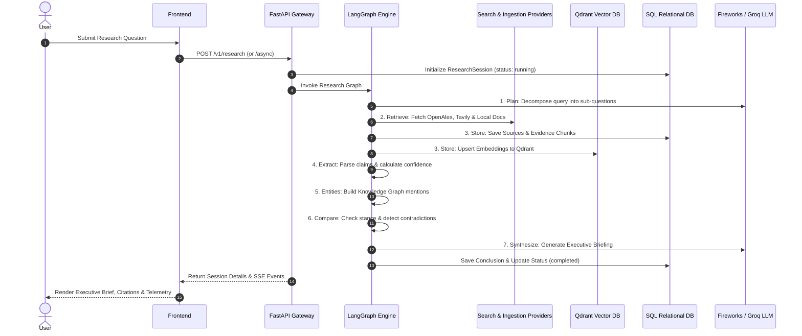

# System Architecture & Component Design

## Overview

Enterprise Research Agent (Atlas) is an evidence-first research orchestration platform. The system combines multi-source evidence retrieval (OpenAlex scholarly papers, Tavily live web search, and uploaded PDF/TXT documents) with a 7-stage deterministic LangGraph execution graph, Qdrant vector indexing, Redis semantic caching, and multi-provider LLM synthesis.

> [!NOTE]
> All evidence ingested by Atlas is traceable to source URLs or uploaded files. Claims extracted during research turns undergo stance cross-verification and contradiction analysis before executive synthesis.

---

## High-Level System Architecture

```mermaid
graph TD
    User["Client / User Interface (Next.js 16)"] ──► API["FastAPI Gateway (Uvicorn)"]
    
    subgraph Security & Middleware
        API ──► Auth["API Key Middleware (X-API-Key)"]
        API ──► Audit["Audit & Telemetry Service"]
    end
    
    subgraph Core Orchestration Engine
        API ──► Graph["LangGraph State Engine (7-Node Pipeline)"]
        Graph ──► Plan["1. Plan Node"]
        Graph ──► Retrieve["2. Retrieve Node"]
        Graph ──► Store["3. Store Node"]
        Graph ──► Extract["4. Extract Node"]
        Graph ──► Entities["5. Entities Node"]
        Graph ──► Compare["6. Compare Node"]
        Graph ──► Synthesize["7. Synthesize Node"]
    end

    subgraph Data Sources & Ingestion
        Retrieve ──► OpenAlex["OpenAlex API (Scholarly Works)"]
        Retrieve ──► Tavily["Tavily Web Search API"]
        Retrieve ──► Parser["PyPDF & Document Parser (Local Files)"]
    end

    subgraph LLM & AI Providers
        Synthesize ──► FW["Fireworks AI (DeepSeek-v3 / DeepSeek-r1)"]
        Synthesize ──► Groq["Groq API (Llama-3.3-70b-versatile)"]
        Synthesize ──► Fallback["Deterministic Fallback Engine"]
    end

    subgraph Storage & Caching Layer
        Store ──► SQL["SQLite / PostgreSQL (Relational DB)"]
        Store ──► Qdrant["Qdrant Vector DB (Dense Embeddings)"]
        Store ──► Redis["Redis REST / Sentinel (Semantic Cache)"]
    end
```

---

## Component Responsibilities

### 1. Frontend Client Dashboard (Next.js 16)
- **Tech Stack**: Next.js 16 (App Router), TypeScript, Tailwind CSS, Lucide Icons.
- **Role**: Provides an interactive workspace for submitting research queries, inspecting live execution timelines via Server-Sent Events (SSE), reviewing confidence scores, exploring knowledge base search results, and generating downloadable executive briefs.

### 2. FastAPI Gateway & Security
- **Tech Stack**: FastAPI, Pydantic v2, Python-Multipart.
- **Role**: Handles HTTP requests, enforces API key verification (`X-API-Key`), manages synchronous and background async research tasks (`BackgroundTasks`), handles multipart file uploads (`.pdf`, `.txt`), and streams execution events via Server-Sent Events.

### 3. LangGraph Orchestration Engine
- **Tech Stack**: LangGraph (`StateGraph`), SQLAlchemy ORM.
- **Role**: Executes a stateful, deterministic graph pipeline with explicit node boundaries. State flows sequentially across planning, retrieval, persistence, claim extraction, entity recognition, contradiction analysis, and LLM synthesis.

### 4. Storage & Vector Indexing Layer
- **SQL Database**: SQLite (Local Dev) or PostgreSQL (Production) for storing `ResearchSession`, `Source`, `Finding`, `Entity`, `LlmCall`, and `AuditLog` records.
- **Qdrant Vector Store**: Vector database for dense semantic embeddings (`fireworks/qwen3-embedding-8b`), powering hybrid knowledge base retrieval.
- **Redis Cache**: High-performance semantic cache for deduplicating queries, storing session tokens, and caching evidence passages.

### 5. Multi-Provider LLM & Search Ecosystem
- **LLM Providers**: Fireworks AI (Primary) and Groq (Secondary), featuring automatic failover and token cost calculation.
- **Search Integrations**: OpenAlex API for scientific and academic literature; Tavily Search API for real-time web news and documents.

---

## Data Ingestion & Evidence Flow



---

## Security & Isolation Boundaries

1. **Authentication**: All API endpoints under `/v1/*` pass through security dependencies (`require_api_key`). If `ATLAS_API_KEY` is configured in environment variables, requests must include a matching `X-API-Key` header.
2. **Data Isolation**: Research sessions can be attached to specific `Project` and `Organization` IDs, providing tenant-level logical boundary isolation.
3. **Graceful Fallbacks**: If external API credentials (Fireworks, Groq, Tavily, Qdrant) are missing or fail, Atlas automatically downgrades to local deterministic extraction and SQLite full-text search without crashing.
