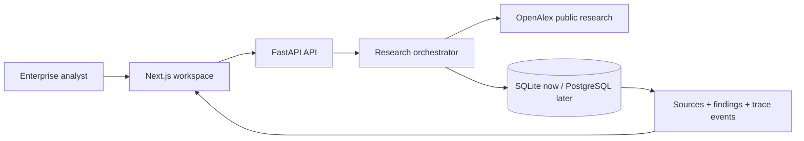

# Atlas architecture

Atlas is a local-first, evidence-first research system. Its demoable core is deliberately narrow: a novel question moves through explicit research stages, saves durable evidence and exposes the trace in the UI.

## Memory

| Type | Current implementation | Production extension |
|---|---|---|
| Episodic | Research sessions and run events | OpenTelemetry traces and replay |
| Evidence | Sources, abstracts, finding spans | Full-text extractor and immutable snapshots |
| Semantic | Durable findings ready for indexing | Qdrant hybrid retrieval and reranking |
| Organizational | API boundary is tenant-ready | PostgreSQL RLS, RBAC, SSO |

## Evaluation gates

1. Do not produce an evidence-backed conclusion where no extracted evidence exists.
2. Every displayed finding has a source ID and evidence span.
3. Preserve a degraded retrieval event when a provider fails.
4. Run `uv run pytest` and `uv run python scripts/evaluate.py` before a demo.

## Observability

Every agent stage writes `step`, status, duration and structured details to `run_events`. `/v1/metrics/overview` reports accumulated research, evidence and run-event counts. This supports a real operations screen without guessing from client state.
