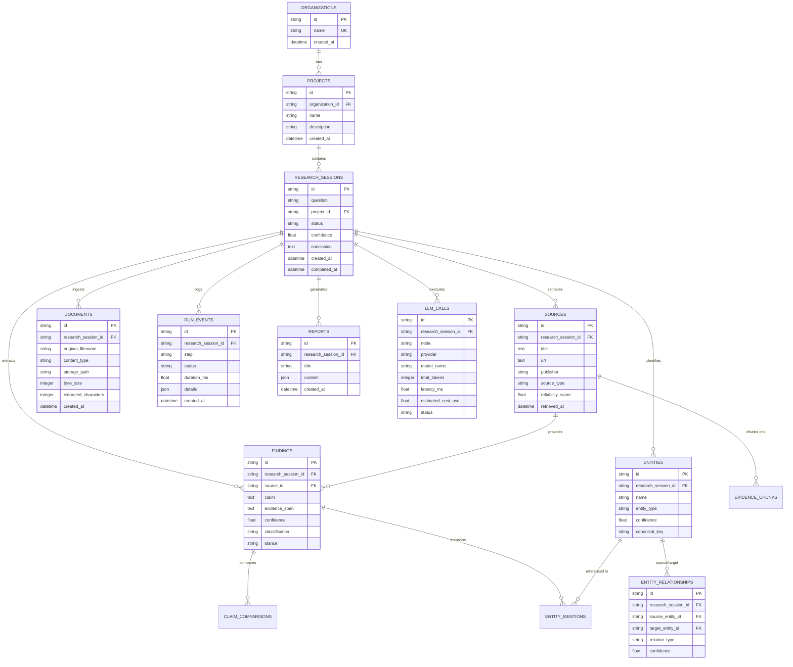

# Database Schema & Data Models

## Overview

The database schema of Enterprise Research Agent (Atlas) is implemented using SQLAlchemy 2.0 ORM with support for SQLite and PostgreSQL. It stores tenant organizations, research projects, evidence sources, extracted claims, entity relationships, execution run events, and telemetry metrics.

---

## Entity-Relationship (ER) Diagram

---

## Detailed Table Reference

### 1. `organizations`
Stores tenant organizations.
- `id` (`VARCHAR(36)` Primary Key): UUID v4 identifier.
- `name` (`VARCHAR(160)` Unique Index): Organization name.
- `created_at` (`DATETIME`): Creation timestamp (UTC).

### 2. `projects`
Logical workspaces belonging to an organization.
- `id` (`VARCHAR(36)` Primary Key): UUID v4 identifier.
- `organization_id` (`VARCHAR(36)` Foreign Key $\rightarrow$ `organizations.id`): Associated organization.
- `name` (`VARCHAR(160)`): Project name.
- `description` (`TEXT` Nullable): Optional project description.
- `created_at` (`DATETIME`): Creation timestamp.

### 3. `research_sessions`
Core entity representing a single research query and execution thread.
- `id` (`VARCHAR(36)` Primary Key): UUID v4 identifier.
- `question` (`TEXT`): Original user research prompt.
- `project_id` (`VARCHAR(36)` Foreign Key $\rightarrow$ `projects.id` Nullable): Optional project link.
- `status` (`VARCHAR(24)` Index): Current state (`queued`, `running`, `completed`, `failed`).
- `confidence` (`FLOAT` Default `0.0`): Overall confidence score ($0.0 - 1.0$).
- `conclusion` (`TEXT` Nullable): Executive synthesis output text.
- `created_at` (`DATETIME`): Session start timestamp.
- `completed_at` (`DATETIME` Nullable): Completion timestamp.

### 4. `sources`
Ingested literature and web reference documents.
- `id` (`VARCHAR(36)` Primary Key): UUID v4 identifier.
- `research_session_id` (`VARCHAR(36)` Foreign Key $\rightarrow$ `research_sessions.id`): Research session link.
- `title` (`TEXT`): Article or paper title.
- `url` (`TEXT`): Origin URL or document URI.
- `publisher` (`VARCHAR(255)` Nullable): Publisher or domain name (e.g. `OpenAlex`, `user_upload`).
- `published_at` (`VARCHAR(32)` Nullable): Publication date.
- `abstract` (`TEXT` Nullable): Abstract or initial text excerpt.
- `reliability_score` (`FLOAT` Default `0.5`): Source credibility weight ($0.0 - 1.0$).
- `canonical_url` (`TEXT` Nullable Index): Normalized URL.
- `content_hash` (`VARCHAR(64)` Nullable Index): SHA-256 content hash for deduplication.
- `source_type` (`VARCHAR(64)` Default `web_article`): Type (`academic_paper`, `web_article`, `user_upload`).

### 5. `documents`
Uploaded physical files (`.pdf`, `.txt`).
- `id` (`VARCHAR(36)` Primary Key): UUID v4 identifier.
- `research_session_id` (`VARCHAR(36)` Foreign Key $\rightarrow$ `research_sessions.id`): Research session link.
- `original_filename` (`VARCHAR(255)`): Filename on client upload.
- `content_type` (`VARCHAR(127)`): MIME type (e.g. `application/pdf`, `text/plain`).
- `storage_path` (`TEXT`): Server local disk storage path.
- `byte_size` (`INTEGER`): File size in bytes.
- `extracted_characters` (`INTEGER`): Character length of extracted plain text.

### 6. `findings`
Atomic evidence claims extracted from sources.
- `id` (`VARCHAR(36)` Primary Key): UUID v4 identifier.
- `research_session_id` (`VARCHAR(36)` Foreign Key $\rightarrow$ `research_sessions.id`): Session link.
- `source_id` (`VARCHAR(36)` Foreign Key $\rightarrow$ `sources.id` Nullable): Source link.
- `claim` (`TEXT`): Extracted factual statement.
- `evidence_span` (`TEXT`): Direct textual quote supporting the claim.
- `confidence` (`FLOAT`): Fact confidence score ($0.0 - 1.0$).
- `classification` (`VARCHAR(64)`): Category tag (`research_evidence`, `user_provided_document`).
- `topic_key` (`VARCHAR(160)` Nullable Index): Categorical topic cluster key.
- `stance` (`VARCHAR(24)` Default `unclear`): Stance tag (`supports`, `contradicted`, `unclear`).

### 7. `entities` & `entity_relationships`
Entity graph tracking named entities and relationships across research sessions.
- `entities`: Stores entity `name`, `entity_type` (e.g., `concept`, `organization`, `method`), `canonical_key`, and `confidence`.
- `entity_relationships`: Stores directed edges between `source_entity_id` and `target_entity_id` with `relation_type` and `confidence`.

### 8. `llm_calls`
Operational logs for LLM request latency and token accounting.
- `id` (`VARCHAR(36)` Primary Key): UUID v4 identifier.
- `research_session_id` (`VARCHAR(36)` Foreign Key $\rightarrow$ `research_sessions.id` Nullable): Session link.
- `request_id` (`VARCHAR(36)` Index): Request correlation ID.
- `node` (`VARCHAR(32)`): LangGraph node name (`plan`, `synthesize`, etc.).
- `provider` (`VARCHAR(32)`): Provider name (`fireworks`, `groq`).
- `model_name` (`VARCHAR(255)` Nullable): Exact model identifier.
- `prompt_tokens` / `completion_tokens` / `total_tokens` (`INTEGER` Nullable): Token statistics.
- `latency_ms` (`FLOAT`): Execution duration in milliseconds.
- `estimated_cost_usd` (`FLOAT` Nullable): Calculated API usage cost in USD.
- `status` (`VARCHAR(24)`): Execution status (`success`, `failed`).
